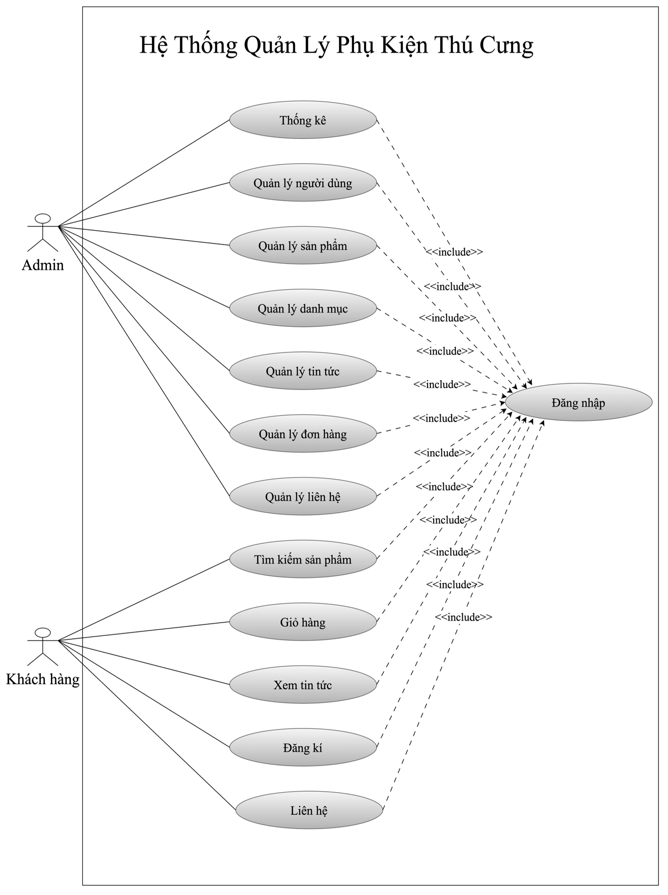

# TMDT_PESTSHOP – Pet Accessories E‑commerce

A full‑stack web app for a pet accessories shop. The project contains a **Vue 3 + Vite** frontend and a **Node.js/Express + Sequelize (MySQL/SQLite)** backend API. Features include authentication (email/password & Google Sign‑In), product catalog with categories, shopping cart/checkout, news/blog, orders, media uploads, dashboard stats, and role‑based access control.

> Repo layout (per your screenshots):
>
> - `petfinal/` – Frontend (Vue 3 + Vite + Pinia + Vue Router)
> - `API/` – Backend API (Express + Sequelize). Static files served at `/files`

---

## ✨ Features

- Product listing, detail, search (`s`), filter by **pet** and **product** categories, sale items
- Auth: JWT login/register, Google Sign‑In (`vue3-google-signin`, `google-auth-library`)
- Role‑based access (middleware: `auth.mw`, `role.mw`)
- Orders & payments (`/api/order`, `/api/pay`)
- Media upload with `multer`, static hosting at `/files`
- News/Blog module (`/api/news`)
- Dashboard KPIs (`/api/dashboard`)
- Notifications UI (`@kyvg/vue3-notification`), charts (`chart.js` + `vue-chartjs`)
- Timezone awareness (`moment`, `moment-timezone`)

---

## 🏗️ Tech Stack

**Frontend**
- Vue 3 (Composition API, Vue Router, Pinia)
- Vite
- Bootstrap 5, Bootstrap‑Vue (styles/components)
- Chart.js + vue-chartjs
- Swiper
- Google Sign‑In (`vue3-google-signin`)
- Axios

**Backend**
- Node.js, Express
- Sequelize ORM (MySQL or SQLite)
- JWT (`jsonwebtoken`), bcrypt
- Multer (upload), CORS, dotenv
- Google Auth (`google-auth-library`)
- Utilities: lodash, moment, moment‑timezone

---

## 📁 Folder Structure (high level)

```
TMDT_PESTSHOP/
├─ API/                      # Backend API
│  ├─ src/
│  │  ├─ app.js              # Express app bootstrap
│  │  ├─ routers/
│  │  │  ├─ auth.route.js
│  │  │  ├─ product.route.js
│  │  │  ├─ news.route.js
│  │  │  ├─ public.route.js
│  │  │  ├─ media.route.js
│  │  │  ├─ category-pet.route.js
│  │  │  ├─ category-product.route.js
│  │  │  ├─ users.route.js
│  │  │  ├─ contact.route.js
│  │  │  ├─ user-order.route.js
│  │  │  └─ dashboard.route.js
│  │  ├─ middleware/
│  │  │  ├─ auth.mw.js       # JWT verify
│  │  │  ├─ role.mw.js       # RBAC
│  │  │  └─ hanlder-error.js # Global error handler
│  │  ├─ models/             # Sequelize models (Product, CategoryPets, CategoryProducts, User, Order, ...)
│  │  ├─ services/           # (optional) business logic
│  │  ├─ config/             # Sequelize + app config
│  │  └─ public/             # Uploaded files served at /files
│  ├─ package.json
│  └─ .env.example
└─ petfinal/                 # Frontend
   ├─ src/
   │  ├─ api/                # axios instances & API helpers
   │  ├─ assets/
   │  ├─ components/
   │  ├─ router/
   │  ├─ stores/             # Pinia stores (auth, cart, products, ...)
   │  ├─ utils/
   │  ├─ views/              # pages
   │  ├─ App.vue
   │  └─ main.js
   ├─ index.html
   └─ package.json
```

> _Note:_ Folder/file names above follow your screenshots and imports in code you shared.

---

## ⚙️ Environment Variables

Create **`API/.env`** with:

```env
# Server
PORT=8000
HOST_BASE=http://localhost:8000

# Database (choose MySQL or SQLite)
DB_DIALECT=mysql            # or sqlite
DB_HOST=localhost
DB_PORT=3306
DB_NAME=petshop
DB_USER=root
DB_PASS=

# For SQLite (if used)
SQLITE_STORAGE=./data/petshop.sqlite

# JWT
JWT_SECRET_KEY=replace-with-strong-secret

# Google OAuth (optional for Google Sign-In)
GOOGLE_CLIENT_ID=your-google-client-id.apps.googleusercontent.com
GOOGLE_CLIENT_SECRET=your-google-client-secret

# Uploads
UPLOAD_DIR=./src/public/uploads
```

Create **`petfinal/.env`** (Vite) with the API base:

```env
VITE_API_BASE=http://localhost:8000
VITE_GOOGLE_CLIENT_ID=your-google-client-id.apps.googleusercontent.com
```

---

## 🧰 Install & Run

### 1) Backend API

```bash
cd API
npm i
# migrate & seed (example – adapt to your sequelize setup)
# npx sequelize db:migrate
# npx sequelize db:seed:all
npm run dev     # nodemon ./src/app.js
```

By default the server runs at `http://localhost:${PORT}` and serves uploads at `http://localhost:${PORT}/files`.

### 2) Frontend (Vite)

```bash
cd petfinal
npm i
npm run dev     # Vite dev server on port 3000
```

Open `http://localhost:3000` in your browser.

---

## 🔌 API Overview

> Base URL: `http://localhost:8000/api`

### Auth
```
POST   /auth/register        # body: {name, email, password}
POST   /auth/login           # body: {email, password}
POST   /auth/google          # body: {idToken} (verify via google-auth-library)
GET    /users/me             # requires Bearer <JWT>
```
Middleware: `verifyToken` reads `Authorization: Bearer <token>` (or `token` in query/body) and verifies with `JWT_SECRET_KEY`.

### Products
```
GET    /products             # query: page, limit, s, sale, cat_pet, cat_pro
GET    /products/:id
POST   /products             # (admin) create
PUT    /products/:id         # (admin) update
DELETE /products/:id         # (admin/soft-delete)
```
- Search by name: `?s=collar`
- Filter by pet category: `?cat_pet=1`
- Filter by product category: `?cat_pro=2`
- Sale items: `?sale=1`
- Pagination: `?page=1&limit=12`  
Response example for list:
```json
{
  "total": 120,
  "totalPages": 10,
  "currentPage": 1,
  "list": [
    {
      "id": 1,
      "name": "Cat Harness",
      "price": 250000,
      "discount": 10,
      "sale": 1,
      "cat_pet": 1,
      "cat_pro": 3,
      "catPet": { "id": 1, "name": "Cat" },
      "catPro": { "id": 3, "name": "Harness" },
      "picture": "http://localhost:8000/files/uploads/cat-harness.jpg"
    }
  ]
}
```

### Categories
```
GET  /category-pet           # e.g., Dog, Cat
GET  /category-product       # e.g., Collar, Food, Harness
```

### Media
```
POST /media/upload           # multipart/form-data, field: file
GET  /files/<path>           # static serving
```

### Orders & Payments
```
POST   /order                # create order
GET    /order/:id
POST   /pay                  # initiate payment (implementation-specific)
```

### News / Blog
```
GET    /news
GET    /news/:slug
POST   /news                 # (admin)
```

### Dashboard
```
GET /dashboard               # aggregated KPIs (sales, orders, top products, ...)
```

### Public
```
GET /public/health           # health check
GET /public/config           # public runtime configs (if any)
```

> Centralized error handling via `hanlder-error` middleware.

---

## 🗄️ Database Models (minimum)

> Adjust to your actual Sequelize models.

**Product**
- `id`, `name`, `price`, `discount`, `sale`, `picture`, `cat_pet`, `cat_pro`, `status`
- associations: `belongsTo(CategoryPets, {foreignKey: 'cat_pet'})`, `belongsTo(CategoryProducts, {foreignKey: 'cat_pro'})`

**CategoryPets**
- `id`, `name`, `status`

**CategoryProducts**
- `id`, `name`, `status`

**User**
- `id`, `name`, `email`, `password_hash`, `role` (`user`/`admin`), `provider` (`local`/`google`)

**Order, OrderItem**
- Typical order schema with totals, status, and line items

---

## 🔐 Auth & Security

- Passwords hashed with `bcrypt`
- JWT tokens signed with `JWT_SECRET_KEY` and passed as **Bearer** tokens
- Role checks with `role.mw` for admin routes
- CORS enabled for the frontend origin
- `.env` never committed

---

## 🧪 Testing (suggested)

- API tests with **Postman** (collections) or **supertest**
- E2E/UI tests with **Cypress** for key flows: login, browse, add to cart, checkout

---

## 🚀 Deployment Notes

- Build frontend: `npm run build` in `petfinal` → deploy static assets
- Run API behind a reverse proxy (Nginx) with `pm2` or Docker
- Configure env vars on server; serve uploads from persistent volume `API/src/public`

---

## 🛠️ Troubleshooting

- **Invalid token** → ensure `Authorization: Bearer <JWT>` header and correct `JWT_SECRET_KEY`
- **Uploads 404** → check file path and that `/files` serves `src/public`
- **DB connection errors** → verify `DB_*` envs and Sequelize dialect
- **CORS** → add frontend origin to CORS config
- **Google Sign‑In** → use the same `GOOGLE_CLIENT_ID` on both FE (`VITE_…`) and BE

---

## 🗺️ Roadmap (ideas)

- Cart & checkout flows on FE (Pinia store + API)
- Payment gateway integration & webhooks
- Admin dashboard (products, categories, orders, users)
- i18n, dark mode
- CI/CD pipeline (lint/test/build/deploy)

---

## 📄 License

MIT (c) 2025

---

## 👤 Author

**Tran Thi Linh** – 4th‑year student, Faculty of IT, HUNRE  
- GitHub: https://github.com/linhtran17

---

## 📐 System Analysis & Design

### 🎭 Actors of the System

**Admin (Người quản trị):**
- Đăng nhập hệ thống quản trị.
- Thống kê đơn hàng (đơn mới, đang xử lý, đã giao, hủy).
- Quản lý người dùng: thêm, sửa, xóa, phân quyền.
- Quản lý sản phẩm: thêm mới, chỉnh sửa, xóa, tìm kiếm sản phẩm.
- Quản lý danh mục sản phẩm: thêm, sửa, xóa, tìm kiếm.
- Quản lý tin tức: đăng, sửa, xóa, tìm kiếm bài viết liên quan đến thú cưng.
- Quản lý đơn hàng: thay đổi trạng thái, hủy đơn hàng của khách.
- Quản lý liên hệ: xử lý các phản hồi từ khách hàng.

**Khách hàng:**
- Đăng ký/Đăng nhập: tạo tài khoản hoặc đăng nhập để mua hàng.
- Tìm kiếm sản phẩm: theo tên, giá, danh mục.
- Xem danh sách và chi tiết sản phẩm.
- Giỏ hàng: thêm sản phẩm, cập nhật số lượng, xóa sản phẩm.
- Đặt hàng và thanh toán (tích hợp VNPay OTP).
- Xem tin tức/bài viết liên quan đến thú cưng.
- Gửi liên hệ: gửi câu hỏi, phản hồi đến quản trị viên.

### 🗂️ Use-case Diagram

Hệ thống được mô tả qua sơ đồ Use-case với các chức năng chính:  
- Thống kê, Quản lý người dùng, sản phẩm, danh mục, tin tức, đơn hàng, liên hệ (cho Admin).  
- Đăng ký/Đăng nhập, Tìm kiếm sản phẩm, Giỏ hàng, Đặt hàng, Liên hệ, Xem tin tức (cho Khách hàng).  



### 🔑 Chức năng chính (theo nhóm người dùng)

| Tác nhân | Chức năng |
|----------|-----------|
| **Admin** | Thống kê đơn hàng, Quản lý người dùng, Quản lý sản phẩm, Quản lý danh mục, Quản lý tin tức, Quản lý đơn hàng, Quản lý liên hệ |
| **Khách hàng** | Đăng ký/Đăng nhập, Tìm kiếm sản phẩm, Xem sản phẩm, Giỏ hàng, Đặt hàng & Thanh toán, Xem tin tức, Liên hệ |

---

## 🖼️ Giao diện phần mềm

Một số hình ảnh minh họa:

- Trang chủ với banner khuyến mãi, danh sách sản phẩm.  
- Form đăng nhập (có đăng nhập Google).  
- Dashboard quản trị: thống kê trạng thái đơn hàng, biểu đồ.  
- Quản lý sản phẩm: danh sách, thêm/sửa/xóa.  
- Giỏ hàng & Đặt hàng: cập nhật số lượng, tính thành tiền.  
- Thanh toán tích hợp **VNPay** OTP.

(Ảnh minh họa đính kèm trong thư mục `docs/screenshots/`)
