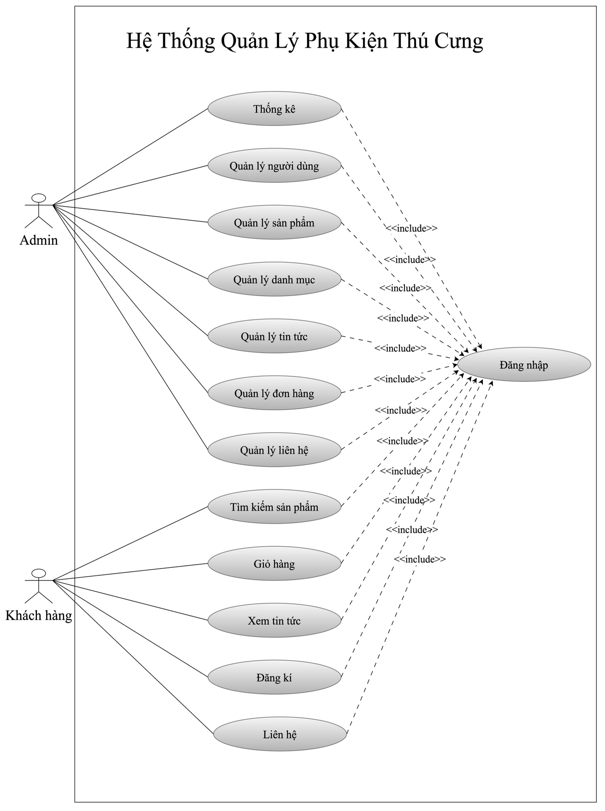
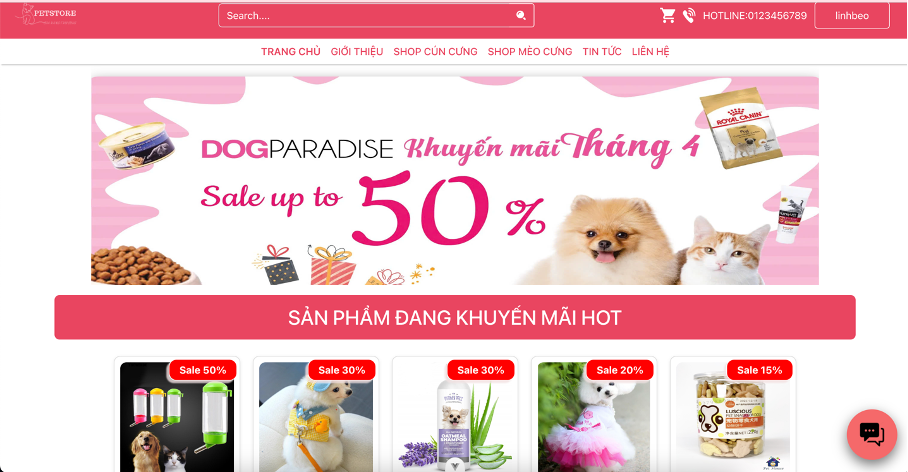
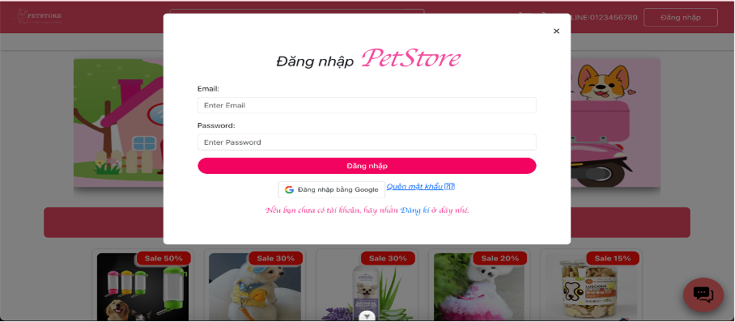
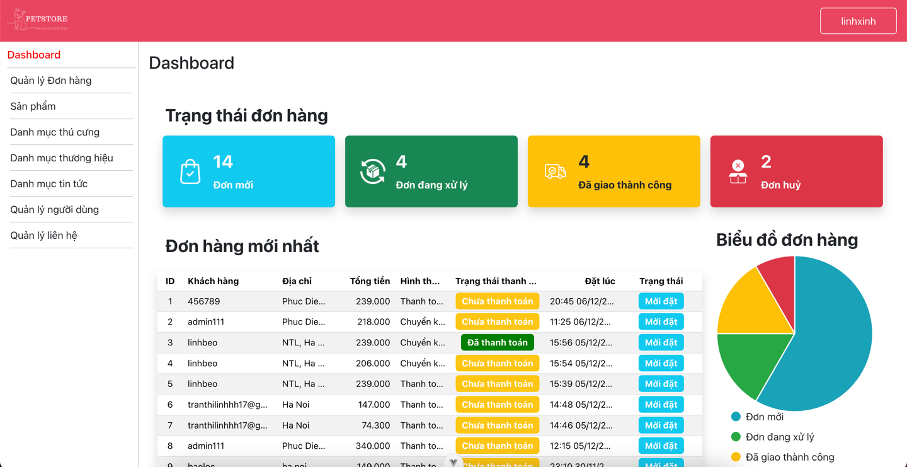
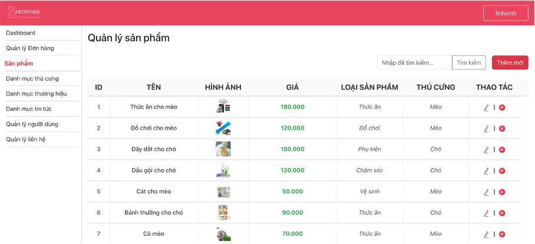
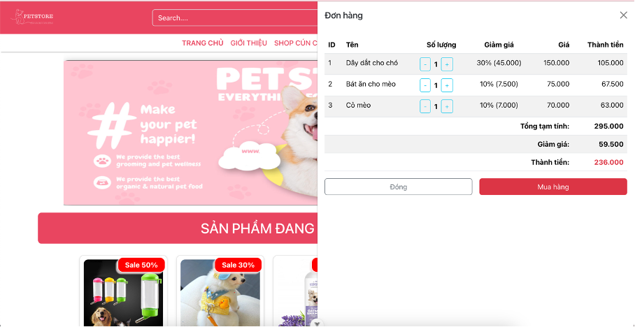
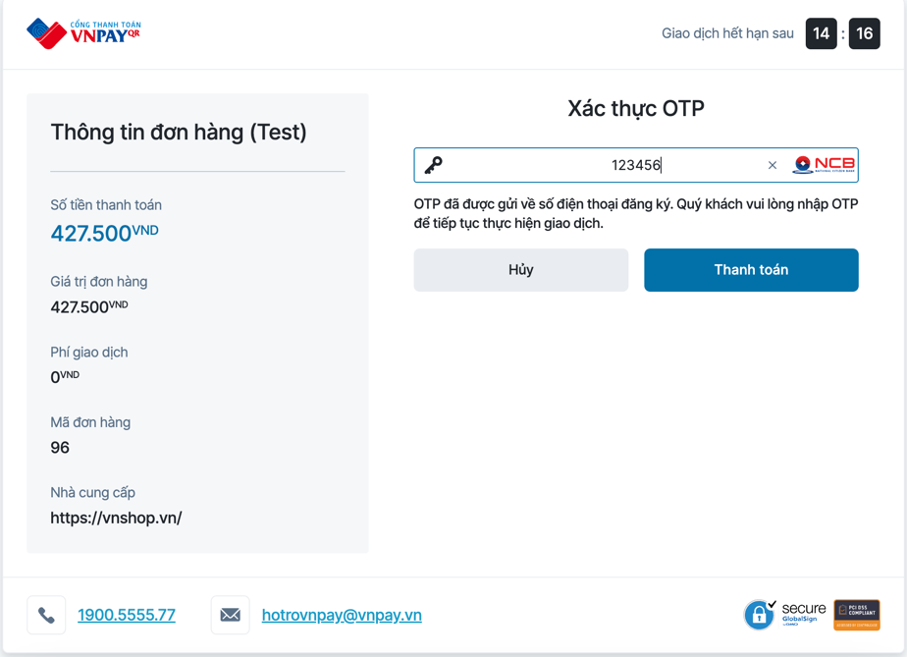

# TMDT_PESTSHOP – Pet Accessories E-commerce

A full-stack web app for a pet accessories shop. The project contains a **Vue 3 + Vite** frontend and a **Node.js/Express + Sequelize (MySQL/SQLite)** backend API. Features include authentication (email/password & Google Sign-In), product catalog with categories, shopping cart/checkout, news/blog, orders, media uploads, dashboard stats, and role-based access control.

> Repo layout:
> - `petfinal/` – Frontend (Vue 3 + Vite + Pinia + Vue Router)
> - `API/` – Backend API (Express + Sequelize). Static files served at `/files`

---

## ✨ Features

- Product listing, detail, search (`s`), filter by categories, sale items
- Auth: JWT login/register, Google Sign-In
- Role-based access (middleware: `auth.mw`, `role.mw`)
- Orders & payments (VNPay OTP)
- Media upload with `multer`
- News/Blog module
- Dashboard KPIs
- Notifications UI (`@kyvg/vue3-notification`), charts (`chart.js` + `vue-chartjs`)

---

## 🏗️ Tech Stack

**Frontend**
- Vue 3 (Composition API, Vue Router, Pinia)
- Vite
- Bootstrap 5, Bootstrap-Vue
- Chart.js + vue-chartjs
- Swiper
- Google Sign-In, Axios

**Backend**
- Node.js, Express
- Sequelize ORM (MySQL/SQLite)
- JWT, bcrypt
- Multer, CORS, dotenv
- Google Auth, moment, lodash

---

## 📁 Folder Structure

```
TMDT_PESTSHOP/
├─ API/                      # Backend API
│  ├─ src/
│  │  ├─ app.js
│  │  ├─ routers/
│  │  ├─ middleware/
│  │  ├─ models/
│  │  └─ public/
│  └─ package.json
└─ petfinal/                 # Frontend
   ├─ src/
   │  ├─ api/
   │  ├─ components/
   │  ├─ router/
   │  ├─ stores/
   │  ├─ views/
   │  └─ main.js
   └─ package.json
```

---

## ⚙️ Environment Variables

**API/.env**
```env
PORT=8000
HOST_BASE=http://localhost:8000
DB_DIALECT=mysql
DB_HOST=localhost
DB_PORT=3306
DB_NAME=petshop
DB_USER=root
DB_PASS=
JWT_SECRET_KEY=secret
GOOGLE_CLIENT_ID=...
GOOGLE_CLIENT_SECRET=...
UPLOAD_DIR=./src/public/uploads
```

**petfinal/.env**
```env
VITE_API_BASE=http://localhost:8000
VITE_GOOGLE_CLIENT_ID=...
```

---

## 🧰 Install & Run

### Backend
```bash
cd API
npm install
npm run dev
```

### Frontend
```bash
cd petfinal
npm install
npm run dev
```

---

## 📐 System Analysis & Design

### 🎭 Actors

**Admin**
- Thống kê đơn hàng
- Quản lý người dùng
- Quản lý sản phẩm, danh mục
- Quản lý tin tức
- Quản lý đơn hàng
- Quản lý liên hệ

**Khách hàng**
- Đăng ký/Đăng nhập
- Tìm kiếm, xem sản phẩm
- Giỏ hàng, đặt hàng, thanh toán VNPay
- Xem tin tức
- Liên hệ

### 🗂️ Use-case Diagram


---

## 🖼️ UI Screenshots

### Trang chủ


### Đăng nhập


### Dashboard quản trị


### Quản lý sản phẩm


### Giỏ hàng & Đặt hàng


### Thanh toán VNPay


---

## 👤 Author

**Tran Thi Linh** – 4th-year student, Faculty of IT, HUNRE  
GitHub: [linhtran17](https://github.com/linhtran17)

---

## 📄 License

MIT © 2025
